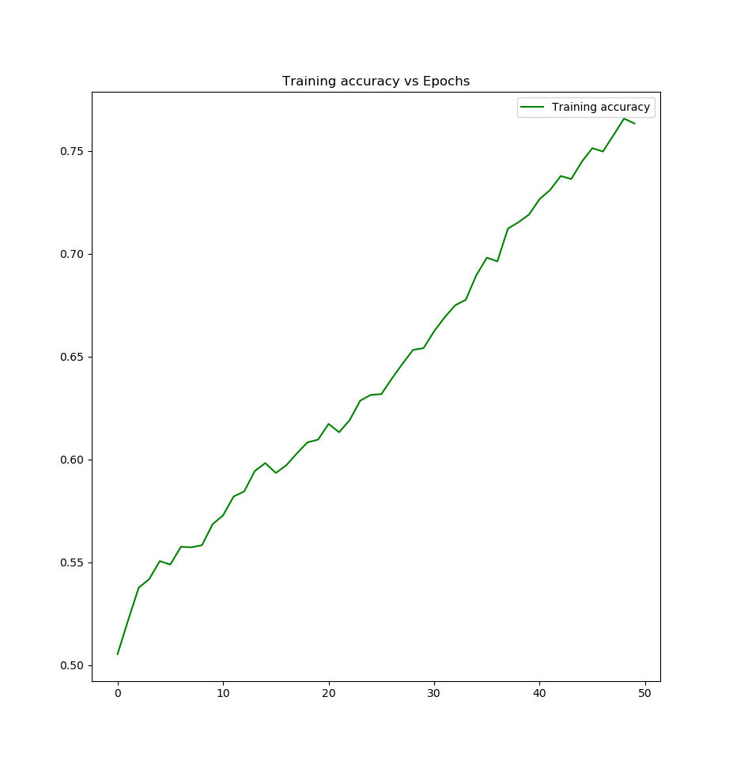
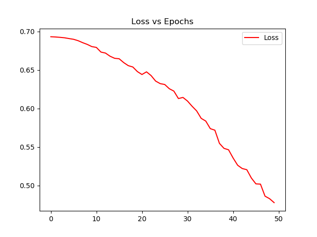
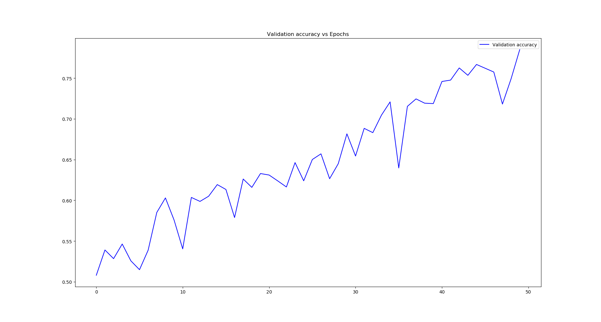
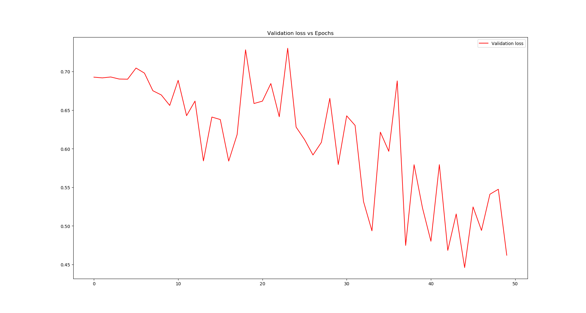

# Image-Classification-using-CNNs
This is the repository for the project - Image-Classification-using-CNNs. The goal was to classify Dogs and Cats in a given image.

### Training Results
 

### Validation Results
 

### Test Results
#### Predicted label: Cat = 0 Dog = 1
 

## System and library requirements.
 - Python3
 - Numpy
 - Tensorflow 2.1.0
 - Cuda 10.2
 - glob
 - matplotlib
 - Keras 
 
## How to Run
1. Clone this repo or extract the "nalindas_proj_6.zip" file.  
2. Navigate to the folder "Code"  
3. Inside the python script - `train.py`, you need to specify the appropriate original training dataset path in the `TRAINING_DIR` variable in the `main` function. 
4. Inside the python script - `test.py`, you need to specify the appropriate original test dataset path in the `glob.glob` argument in the `test` function.
5. In the terminal, run the command `python train.py` to train the VGG-16 CNN in Keras Tensorflow. Once the model has trained, the model weights will be save in a file `trainedCNN_weights.h5`.
6. In the terminal, run the command `python test.py` to test the VGG-16 CNN in Keras Tensorflow. The output csv file `cnn_test.csv` will be generated with the test image id and its correspondng predicted label.
